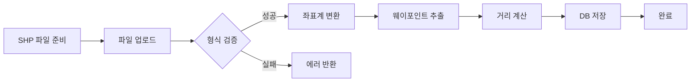
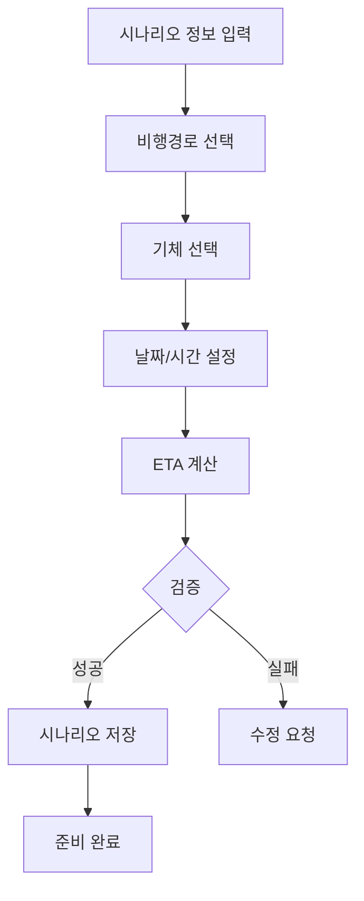
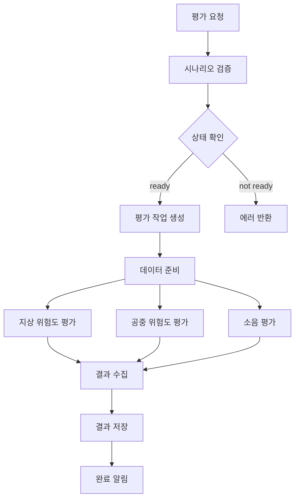

# RNEP 시스템 워크플로우

## 1. 전체 워크플로우 개요

RNEP 시스템의 주요 워크플로우는 다음과 같이 진행됩니다:

1. **비행경로 준비** → 2. **시나리오 생성** → 3. **평가 실행** → 4. **결과 활용**

## 2. 상세 워크플로우

### 2.1 비행경로 임포트 프로세스



**단계별 설명:**
1. 사용자가 QGIS에서 생성한 SHP 파일 준비
2. API를 통해 파일 업로드
3. 파일 형식 및 좌표계 검증
4. 필요시 WGS84로 좌표계 변환
5. LineString에서 웨이포인트 추출
6. 웨이포인트 간 거리 계산
7. 데이터베이스에 비행경로 저장

### 2.2 시나리오 생성 프로세스



**ETA 계산 로직:**
```python
def calculate_eta(waypoints, departure_time, aircraft):
    current_time = departure_time
    eta_list = []
    
    for i, waypoint in enumerate(waypoints):
        if i == 0:
            eta = current_time
        else:
            # 거리 및 고도차 기반 시간 계산
            distance = waypoint.distance_from_previous
            alt_diff = waypoint.alt - waypoints[i-1].alt
            
            # 수평 이동 시간
            horizontal_time = distance / aircraft.cruise_speed
            
            # 수직 이동 시간
            if alt_diff > 0:
                vertical_time = alt_diff / aircraft.climb_rate
            else:
                vertical_time = abs(alt_diff) / aircraft.descent_rate
            
            # 더 긴 시간 적용
            travel_time = max(horizontal_time, vertical_time)
            eta = current_time + travel_time
            
        eta_list.append(eta)
        current_time = eta
    
    return eta_list
```

### 2.3 평가 실행 프로세스



**평가 데이터 준비:**
- 시나리오 데이터 로드
- 기체 성능 파라미터 추가
- 환경 데이터 수집 (인구밀도, 건물정보, 기상정보 등)
- 각 알고리즘별 입력 형식으로 변환

### 2.4 결과 출력 프로세스


**출력 파일 구성:**
```
evaluation_results.zip
├── ground_risk/
│   ├── risk_grid.shp
│   ├── risk_grid.shx
│   ├── risk_grid.dbf
│   ├── risk_grid.prj
│   └── risk_grid.qml        # QGIS 스타일
├── air_risk/
│   └── ...
├── noise/
│   ├── noise_contours.shp
│   └── ...
└── metadata.json           # 평가 메타데이터
```

## 3. 데이터 흐름도

### 3.1 입력 데이터 흐름

```
외부 시스템 → RNEP → 평가 알고리즘
    │           │          │
    ├─ QGIS     ├─ EDIO    ├─ UNIST
    ├─ SHP      ├─ 변환    ├─ 건국대
    └─ 사용자    └─ 검증    └─ 기타
```

### 3.2 처리 데이터 흐름

```
시나리오 → 전처리 → 평가 → 후처리 → 출력
    │        │       │       │        │
    ├─ 검증   ├─ 정규화 ├─ 실행  ├─ 집계   ├─ SHP
    ├─ ETA   ├─ 변환   ├─ 대기  ├─ 변환   ├─ Style
    └─ 저장   └─ 캐싱  └─ 완료  └─ 저장   └─ ZIP
```

## 4. 상태 관리

### 4.1 시나리오 상태

```
draft → ready → evaluating → completed
  ↓       ↓         ↓            ↓
(편집중) (평가대기) (평가중)    (완료)
```

### 4.2 평가 요청 상태

```
pending → processing → completed
   ↓          ↓           ↓
(대기중)    (처리중)     (완료)
             ↓
          failed
          (실패)
```

## 5. 에러 처리

### 5.1 복구 가능한 에러
- 좌표계 불일치: 자동 변환
- 누락된 고도 정보: 기본값 적용
- 타임아웃: 재시도

### 5.2 복구 불가능한 에러
- 잘못된 파일 형식
- 필수 데이터 누락
- 알고리즘 실행 실패

## 6. 성능 최적화

### 6.1 캐싱 전략
- Redis를 통한 중간 결과 캐싱
- 동일 시나리오 재평가 시 캐시 활용

### 6.2 병렬 처리
- 평가 유형별 독립적 실행
- 대용량 데이터 청크 단위 처리

### 6.3 리소스 관리
- 파일 업로드 크기 제한 (100MB)
- 동시 평가 요청 수 제한
- 오래된 결과 파일 자동 삭제